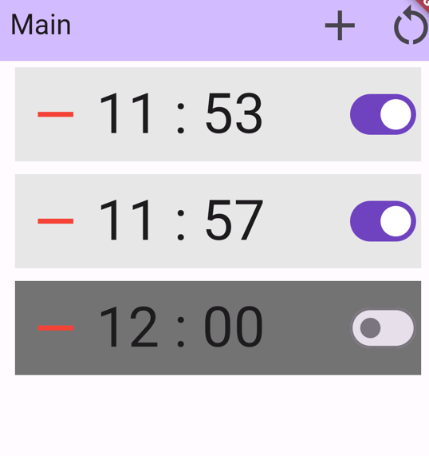
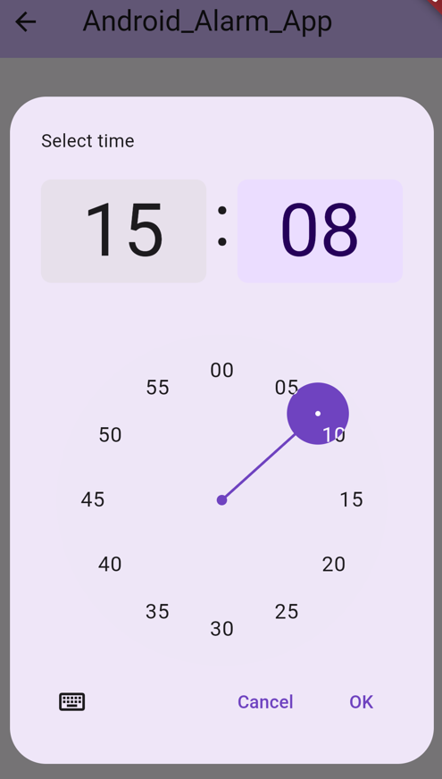

# アンドロイド用アラームアプリの練習
- Flutterの勉強がてら作ってみました。
 

## スクリーンショット
### メイン画面

 

### 時刻設定画面

  

## 搭載したい機能(完了済みの機能は線で消す予定)
- <u>標準の目覚ましアプリと同様に時刻を指定できる(トグルなどで鳴らすかどうかを選択できる)</u>
- アラームを設定したら通知で設定された時刻を表示
- <u>指定時刻にアラームを鳴らす</u>
- <u>スマホを振ると目覚ましが止まる</u>
- (アラームを好きな曲にできる)
  

## 現時点(2024年1月3日)で発生している問題点
- スマホを5回振ったら止められるようにしたいが、2回とかで止まるときもある。
- 起動した状態だと右上のボタンを押さないとセーブしたデータを読み込まない。
  

## 参考サイトなど
- riverpod関連：https://youtu.be/0HVru4WtdWo?list=PLY1cxwSQf6nzcA62KQSgkL1TwAeM1Raaj
- ローカル通知の基礎：https://youtu.be/26TTYlwc6FM
- 指定時刻のローカル通知：https://youtu.be/T6Wg0AmIESE
  

## 使用パッケージ(カッコ内はバージョン)
- flutter_local_notifications(15.0.0)：ローカル通知。バージョンを15以降にすると指定時刻での通知が上手くできませんでした。
- flutter_riverpod(2.4.9)：状態管理に使用
- riverpod_annotation(2.3.3)：同上
- riverpod_generator(2.3.9)：riverpod_annotationにおけるコードの自動生成に使用。
- build_runner(2.4.7)：同上
- shared_preferences(2.2.2)：アラームの保存
- shake(2.2.0)：スマホを振るときに使用
- flutter_ringtone_player(3.2.0)：アラームを鳴らす。
- android_alarm_manager_plus(3.0.3)：アンドロイド用で指定時刻にバックグラウンドで処理が可能。
  

